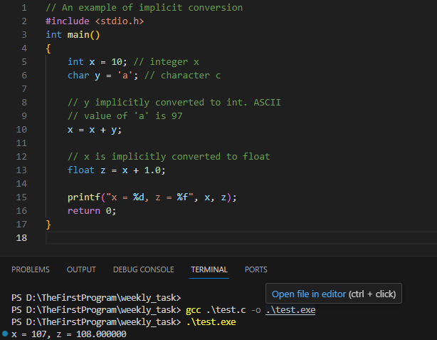
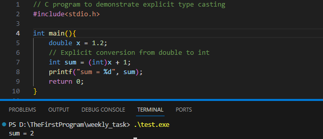
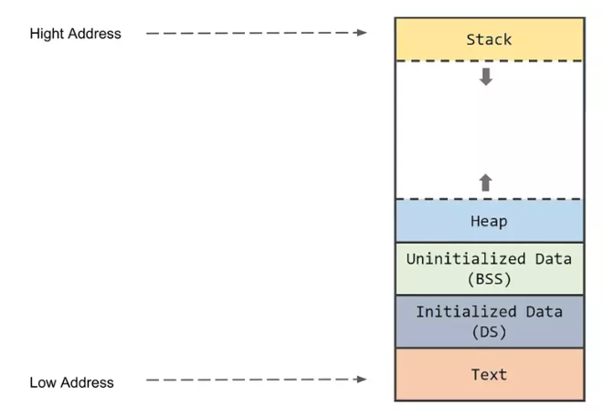
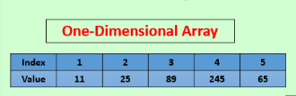
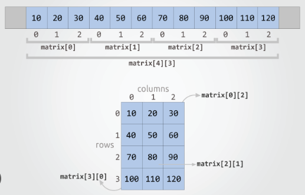
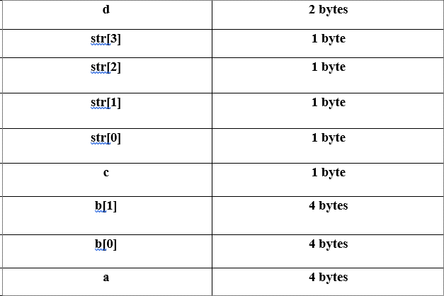

**Table of content**
- [**Week 3**](#week-3)
  - [**Task:**](#task)
  - [**1. Type coercion**](#1-type-coercion)
  - [**2. Flow control**](#2-flow-control)
  - [**3. Memory layout:**](#3-memory-layout)
  - [**4. Variable address**](#4-variable-address)
  - [**5. Function addresses**](#5-function-addresses)
  - [**6. Function in C**](#6-function-in-c)
  - [**7.Array**](#7array)
  - [**8. How C works**](#8-how-c-works)
  - [**9. Clean code**](#9-clean-code)
  - [**10. Common GCC flag**](#10-common-gcc-flag)

# **Week 3**
## **Task\:**
- **Ép kiểu**

- **Các loại cấu trúc điều khiển và rẽ nhánh. Từ khóa break và continue.**

- **Tổ chức bộ nhớ của chương trình C, tìm hiểu mỗi phần bộ nhớ (như stack, heap, ...) sẽ lưu trữ những gì. Tìm hiểu về địa chỉ bộ nhớ, địa chỉ của biến, địa chỉ của hàm. Vẽ minh họa vùng nhớ stack khi chạy đoạn code sau\:**

```c
 int a;

float b[2];

char c;

char str[4];

short d; 
```
- **Tìm hiểu về hàm trong C. Cách thoát hàm**
- **Tìm hiểu mảng trong C. Mảng 1 chiều và mảng 2 chiều được biểu diễn thế nào trong bộ nhớ, vẽ minh họa. Các cách khởi tạo giá trị cho mảng**
- **Cách chương trình C hoạt động (Xem 3 vid này trong playlist nha: https://youtu.be/SfGuIVzE_Os?si=MpA2b_iPLNz1O_-F)**
- **Tìm hiểu về Clean code. Biết rằng Code Convention rất quan trọng đối với Clean Code, liệt kê nhiều nhất có thể các Code Convention trong C**
- **Tìm hiểu các compiler flag mà C developer nên sử dụng. Thử biên dịch các code của em với các flag đó**
---
---
## **1. Type coercion**
- **Definition\:** Type coercion or Type conversion is the process to convert one data type into another.
- **Types\:**
    - **Implicit type conversion\:** 
      - Also known as autonatic type conversion and done by the compiler itself.
      - Generally taking place when in an expression more than one types of data used.
      - All the data types of the variables are upgraded to the data type of the variable with the largest data type.
        <br>Example\:
         bool $\to$ char $\to$ short int $\to$ int $\to$ unsigned int $\to$ long $\to$ unsigned $\to$ long long $\to$ float $\to$ double $\to$ long double.
        <br>
        Example:
        
    - **Explicit type conversion\:**
      - Also called type casting and it is user-defined. 
      - The user can typecast the result to make it of a particular data type.
       
- **Advantages\:**
  - **Type safety\:** ensure that data is being stored and processed in the correct data type, avoiding potential type mismatches and type errors.
  - **Improved code readability\:** making the intent of your code clearer and easier to understand by explicitly converting data between different types.
  - **Improved performance\:** used to optimize the performance of your code by converting data to a more efficient data type for processing in some cases.
  - **Improved compatibility\:** used to convert data between different types that are not compatible, allowing users to write code that is compatible with a wider range of APIs and libraries.
  - **Improved data manipulation\:** used to manipulate data in various ways, such as converting `int` to `string`, and vice versa, or converting a floating-point number (`float`, `double`) to an integer(`int`, `long`)
  - **Improved data storage\:** used to store data in a more compact form, such as converting a large integer value (`long long `) to a smaller integer type (`short`), or converting a large floating-point value(`long double`) to a smaller floating-point type (`float`).
- **Disadvantages\:**
  - **Loss of precision\:** Converting data from a larger data type to a smaller data type can result in loss of precision, as some of the data may be truncated.
  - **Overflow or underflow\:** Converting data from a smaller data type to a larger data type can result in overflow or underflow if the value being converted is too large or too small for the new data type.
  - **Unexpected behavior\:** happens when converting between signed and unsigned integer types, or when converting between floating-point and integer types.
  - **Confusing syntax\:** having confusing syntax, particularly when using typecast operators or type conversion functions, making the code more difficult to read and understand.
  - **Increased complexity\:** increasing the complexity of your code, making it harder to debug and maintain.
  - **Slower performance\:** sometimes resulting in slower performance, particularly when converting data between complex data types, such as between structures and arrays.
## **2. Flow control**
  - **Definition\:** the management of the execution order of statements, allowing the programmer to control the flow of program execution based on various conditions. Besides, it is used to make decisions, repeat blocks of code, and jump to specific sections of code.
- **Types\:**
  - **Conditional Statements\:** These statements allow the program to make decisions based on a condition. The most commonly used conditional statements are:
    -  `if` statement\: executes a block of code if a certain condition is true.
        ```c
        if(condition){
            //code
        }
        ```
    - `if-else` statement\: executes one block of code if a condition is true and another block if the condition is false.
      ```c
      if(condition){
          //code to execute if the if condition is true
      }
      else {
          //code to execute if the else condition is true
      }
      ```
    - `else-if` statement\: executes one block of code if a condition is true and another block if the other condition is true.
      ```c
      if (condition1) {
      // code to execute if condition1 is true
      } else if (condition2) {
          // code to execute if condition2 is true
      } else {
          // code to execute if none of the conditions are true
      }
      ```
    - `nested-if` statement\: It has if statements inside the another if statement.
      ```c
      #include <stdio.h>

      int main() {
          int x = 10;
          int y = 5;

          if (x > 0) {
              printf("x is positive\n");

              if (y > 0) {
                  printf("y is positive\n");
              } else {
                  printf("y is non-positive\n");
              }
          } else {
              printf("x is non-positive\n");
          }

          return 0;
      }
      ```
    - `switch` statement\: allows for multiple branches of execution based on different values. 
      ```c
      switch (expression) {
          case constant1:
              // code to execute if expression equals constant1
              break;
          case constant2:
              // code to execute if expression equals constant2
              break;
          default:
              // code to execute if expression doesn't match any case
      }
      ```
  - **Looping Statements\:** allows a block of code to be repeated multiple times. The most commonly used looping statements are:

    - `for` loop\: executes a block of code for a fixed number of iterations.
      ```c
      for(initialize; condition; increment/ decrement){
          //code 
      }
      ```
    - `while` loop\: repeats a block of code as long as a certain condition is true.
      ```c
      while(condition){
          //code
      }
      ```
    - `do-while` loop\: repeats a block of code at least once, and then continues repeating as long as a certain condition is true.
      ```c
      do{
          //code
      } while( condition );
      ```
  - **Control Transfer Statements\:** These statements change the normal flow of execution within a program. These statements are also called as Jumping statements.

      - `break` statement\: terminates the execution of a loop or switch statement.
      - `continue` statement\: skips the current iteration of a loop and continues with the next iteration.
      - `goto` statement\: transfers the control from one part of the code to another labeled part.
      - `return` statement\: ends the execution of a function and returns a value to the caller.
## **3. Memory layout\:** 
- **Definition\:** the way that data and program instructions are organized in the computer's memory when a C program is executed

- **Memory segments\:**
  - **Text segment (code segment)\:** This segment includes the executable code of the program. It is typically read-only and stores the compiled machine instructions of the program.
  - **Data segment\:**
    - Initialized data segment(DS segment)\: storing initialized global and static variables which have predefined values at compile time.
    - Uninitialized data segment(BSS segment)\:storing uninitialized global and static variables which have are initialized 0 or `NULL` by default.
  - **Heap\:** 
    - Used for dynamic memory allocation. 
    - Can be managed explicitly by using functions like\:
      - `malloc()`\: used to allocate a block of memory of the specified size in bytes and return a pointer to the allocated memory block, or `NULL` if the allocation fails.
    - This memory part stores data that is dynamically allocated during the execution of a program\:
      - Dynamically allocated variables\: 
        - Arrays and data structures whose sizes are not known at the compile time like struct.
        - Variables whose memory is allocated using functions like `malloc()` and `calloc()` reside in the heap.
      - Dynamically allocated arrays\:
          Arrays allocated using `malloc()` or `calloc()` and can be resized using `realloc()`
      - Dynamic data structures\: nodes or elements of linked lists, trees and graphs. These node and elements are linked together using pointers.
      - Strings\: 
        - Strings whose lengths are not known at compile time.
        - C-style strings created using `malloc()` or `calloc()`
      - Objects in OOP\: objects created using `new` or 


        ```c
        int *arr;
        arr = (int *)malloc(5 * sizeof(int)); //Allocate memory for an integer array of size 5
        if(arr == NULL){
            //Handle allocation failure
        }
        ```
        <br>
      - `calloc()` \: allocates a block of memory for an array of elements, each with a specified size. It initializes the allocated memory block to zero and returns a pointer to the allocated memory block, or `NULL` if the allocation fails.
        <br>
        ```c
        int *arr;
        arr = (int *)calloc(5, sizeof(int)); // Allocate memory for an integer array of size 5, initialized to zero
        if (arr == NULL) {
            // Handle allocation failure
        }
        ```
      - `realloc()`\: change the size of an existing dynamically allocated memory block\.
        If `ptr` is `NULL`, `realloc()` behaves like `malloc(size)`.
        <br>If size is smaller than the original size of the block, the excess bytes are freed.
        <br>If size is larger than the original size of the block, additional memory may be allocated, and the contents of the original block are preserved up to the lesser of the old and new sizes.
        <br>It returns a pointer to the reallocated memory block, or `NULL` if the reallocation fails.
        ```c
        int *new_arr;
        new_arr = (int *)realloc(arr, 10 * sizeof(int)); // Reallocate memory for an integer array of size 10
        if (new_arr == NULL) {
            // Handle reallocation failure
        } else {
            arr = new_arr;
        }
        ```

      - `free()`\:is used to deallocate memory previously   allocated by   `malloc()`, `calloc()`, or `realloc()`.
        It frees the memory block pointed to by pointer, making it available for further allocations.
        Passing a `NULL` pointer to `free()` has no effect.
    - Growing dynamically during program execution and is typically larger than the stack.
  - **Stack\:** is used for local variables, function parameters, return addresses, and function call information. Each function call creates a new stack frame, which contains information such as local variables and the return address. The stack follows the LIFO(last-in-first-out) principle and is managed automatically by the compiler and grows and shrinks as functions are called and return.
  Example\:
  
    ```c
    int a; // 4 bytes
    float b[2];// 2 * 4 = 8 bytes
    char c;// 1 byte
    char str[4]; // 4 * 1 = 4 bytes
    short d;// 2 bytes
    ```

  In stack\:
  
  
- **Memory address\:**
  - **Virtual memory\:** allows each process to have its own virtual memory address space. The virtual memory addresses are mapped to physical memory by the operating system, allowing processes to use more memory than physically available
  - **Pointers\:** stores memory addresses. They allow accessing and manipulating data stored in diffent memory segments. Pointer arithmetic can be performed to navigate through memeory efficiently.
- **Memory alignment and Padding\:**
  - Memory alignment ensures that data is stored at memory addresses that are multiples of their size, which can imrove memory acccess performance.
  - Data structure may be padded to meet alignment requirements. Padding adds extra bytes to ensure that the subsequent data members are aligned properly.
  - Howerver, with each compiler and different CPU, the way of padding extra data is different and users can also adjust the declaration of variables to optimize memory alignment.
  - Example\:
   System 32 bits and 4 bytes alignment
  
    ```c
    #include<stdio.h>
    typedef struct{
      char c1;   // 1 bytes
      int i;    //4 bytes
      char c2;  // 1 bytes
      short s; // 2 bytes
    }mstruct;

    int main(){
      printf("%d",sizeof(mstruct));
      return 0;
    }
    ```
    <br>

    Output\:

    ```c
    sizeof(mstruct): 12 bytes
    ```
      System 32 bits and 4 bytes alignment\:

    ```c
    #include<stdio.h>
    typedef struct{
      char c1;   // 1 bytes
      char c2;  // 1 bytes
      int i;    //4 bytes
      short s; // 2 bytes
    }mstruct;

    int main(){
      printf("%d",sizeof(mstruct));
      return 0;
    }
    ```  
    <br>

    Output\:
    ```c
    sizeof(mstruct): 8 bytes
    ```
## **4. Variable address**
- **Definition\:** variable address is the address where the variable is stored, usually it is in the form of hexadecimal
- **Usage\:**
  - We can use this address to get access to the data stored in it by using address-of-operator(`&`).

    ```c
    int a = 5;
    printf("The address of a is: %p",&a);
    ```

  - Another way to use variable address is to implement pointer variables which store memory addresses as their values.
  
    ```c
    int x  = 10;
    int *ptr = &x; //Pointer to the memory address of x
    ```
  - Besides, pointer arithmetic is used to manipulate the memory addresses.
  
    ```c
    int arr[5] = {1, 2, 3, 4, 5};
    int *ptr = arr; //Pointer to the first element of the array a[0]
    ptr ++; //Pointer to the second element of the array a[1];
    ```
  
## **5. Function addresses**
  - **Definition\:** functions are also stored in memory and their addresses can be obtained like variable addresses.
  - **Usage\:** 
    - **Using the Adress-of Operator(`&`)\:**
   
      ```c
      #include<stdio.h>
      void myFunction(){
        printf("Hello World!");
      }
      int main(){
        printf("Address of myFunction: %p\n",(void*)&myFunction);
        return 0;
      }
      ```
    - **Function pointers\:** are variables that store addresses of functions and they are also declared similarly to regular pointers.
  
      ```c
      #include<stdio.h>

      void myFunction(){
        printf("Hello World!");
      }

      int main(){
        void(*funcPtr)() = &myFunction; //Pointer to the function
        (*funcPtr)();// Call the function using the pointer
        retrun 0;
      }
      ```
    - **Callback functions\:** are functions passed as arguments to other functions, which are called within the body of the function.

      ```c
      #include<stdio.h>
      //Create a f(x)
      void myCallback(){
        printf("Callback function that is called.\n");
      }
      //Create a F(x)
      void doSomething(void(*callback)()){
        printf("Doing something...\n");
        callback(); //Call the callback function
      }

      int main(){
        //F(f(x))
        doSomething(&myCallback);//Pass the address of the callback function 
        return 0;
      }
      ```
    - **Dynamic Function Loading\:** return pointers to dynamically loaded functions, allowing users to call them directly.
      <Actually I do not really understand this code>
      ```c
      #include<stdio.h>
      #include<dlfcn.h>

      int main(){
        void(*func)() = NULL;
        void *handle = dlopen("libmylibrary.so", RTLD_LAZY);
        if (handle){
          func = (void(*)())dlsym(handle, "myFunction");
          if(func){
            func();
          }
          d
        }
        return 0;
      }
      ```

## **6. Function in C**
- **Deinition\:** a function is a block  of code which only runs when it is called. It can also be used many times once defined.
- **Types\:** there are many kinds of functions based on various criteria. Here are some common types of functions\:
  - **Built-in function\:** these are provided by the programming language or its standard library, such as `printf()` and `scanf()`.
  - **User-defined functions\:** these are defined by programmer for a particular purpose.
  For example\:

    ```c
    #include<stdio.h>
    int add(int a, int b){
      return a + b;
    }

    int main(){
      int a = 5, b = 6;
      int result = add(a,b);
      printf("%d",result);
      return 0;
    }
    ```

  - **Library function\:** these are provide by external libraries included in the program to perform specific tasks. For example, in `math.h` library, there are functions like `sin()` and `cos()` for trogonometric calculation or `pow()` for exponetial calculation.
  - **Recursive function\:**  is a function calling itself either directly or indirectly in order to solve a problem.
    For example:
    
    ```c
    int binarySearch(int arr[], int low, int high, int target){
      if(low > high){
        return -1;
      }
      int mid = low + (high - low) / 2;
      if(arr[mid] == target){
        return mid;
      }
      else if( arr[mid] > target){
        return binarySearch(arr, low, mid -1, target);
      }
      else 
        return binarySearch(arr, mid + 1, high, target);
    }
    ```

  - **Inline function\:** is a function defined with the `inline` keyword. When a function is declared as inline, the compiler substitutes the function call directly with the function code at the point where the function is called, rather than executing a serparate function call.
    For example\:

    ```c
    inline int max(int a, int b){
      return (a > b) ? a : b;
    }
    ```
  - **Void function\:** these functions do not return any value and they are typically used for performing actions or tasks without needing to return a result.
  For example\:

    ```c
    void greet(){
      printf("Hello World! \n");
    }
    ```

- **Ways to exit functions\:**
  - Programmers can exit function by using conditional statement and control transfer statement\:
    - **Conditional statements\:** using `if`, `else if` and `else` to conditionally exit the function based on certain conditions. For example\:

      ```c
      void evenNumber( int a){
        if(a > 0 && a % 2 == 0){
          printf("This is an even number");
          return; //exit the function if the value is even
        }
        printf("This is an odd number");
      }
      ```
    - **Control trasfer statements\:** using `break`, `continue`, `return` and `goto` to exit the function. For example\:

       ```c
       //break
        void findNumber(int arr[], int size, int target){
          for(int i = 0; i < size; i ++){
            if(arr[i] == target){
              printf("Number has been found at index: %d\n", i);
              break;
            }
          }
        }
        //continue
        void findNumber(int arr[], int size, int target){
          for(int i = 0; i < size; i ++){
            if(arr[i] != target){
              continue;
            }
            printf("The number is found at index: %d",i);
          }
        }
        // return
         int subtract(int a, int b){
          return a - b;
         }
         // goto
        #include <stdio.h>
        void exampleFunction() {
            printf("Before goto\n");
            goto exit;
            printf("After goto\n");

        exit:
            printf("Exiting function\n");
        }

        int main() {
            printf("Starting program\n");
            exampleFunction();
            printf("Program ended\n");
            return 0;
        }
        ```

  - Besides, programmers can use `exit()` to exit the function. For instance\:

    ```c
    #include <stdlib.h>

    void processInput(int value) {
        if (value < 0) {
            printf("Invalid input\n");
            exit(1); // Exit the program with an error code
        }
        // Continue processing input
    }
    ```
## **7.Array**
- **Definition\:** arrays are collections of elements of the same data type stored in continuous memory locations. They provide a way to store multiple values of the same type under a single name. The size of arrays are always pre-declared before the compile time.
- **Declaration\:** 
  ```c
  datatype arrayName[size];
  // For example:
  int arr[100]; // array of 100 integers
  float arr[100]; // array of 100 real number
  ```
- **Type\:** 
  - **Monodimensional array\:** a collection of elements of the same data type arranged in a single line or sequence. It consists of a single row of elements. Monodimensional arrays are declared and accessed using a single index.
    ```c
    double arr[100]; // a monodimensional array of 100 real numbers
    arr[1] = 3.14; // assign a[1] equal 3.14
    ```
    - Monodimensional array is stored in sequential order in the memory\:
  
      
  - **Multidimensional array\:** is an array of arrays, where each elements of the main array is itself an array. Common examples is two-dimensional arrays with application to matrices, tables. Multidimensional arrays can be used like images, game boards,...
    ```c
    int matrix[10][10]// a matrix of 10 cols and 10 rows
    ```
    - Two-dimensional array is stored in memory as a contuguous block of rows, where each row itself is a contiguous block of elements. In memory, rows are stored one after another, forming a rectangular grid-like structure.
      
- **Array initializations\:**
  - **Direct initialization\:**
      For example\:
      ```c
      int arr[5]={1,2,3,4,5};
      ```
  - **Using loop\:**
      For example\:
      ```c
      int arr[5];
      for(int i=0; i<5;i ++){
        arr[i] == i;
      }
      ```
  - **Using `memset()`\:**
    - Syntax\: `memset(startPoint, value, number of element)`
      For example\:
      ```c
      #include<string.h>
      int arr[5];
      memset(arr, 0, sizeof(arr));// initialize an array of 0
      
      char str[30] = "Learning C/C++ is useful";
      memset(str, '.', 8*sizeof(char));//replacing elements in string.
      ```
  - **Using pointer arithmetic\:**
      For example\:
      ```c
      int arr[5];
      int *ptr = arr;
      for( int i = 0; i < 5; i ++){
        *ptr ++ = i * 2;//Set value at index i to i * 2
      }
      ```
  - **Using array indexing\:**
      For example\:
      ```c
      int arr[5];
      arr[0] = 10; // Set value at index 0 to 10
      arr[1] = 20; // Set value at index 1 to 20
      // Continue for other indices
      ```
## **8. How C works**
- Generally speaking, C program is written in text files with a `.c` extension. Then, the compiler like GCC( GNU Compiler Collection) or Clang will compile these `.c` file into machine code `.obj` files. In other words, the compiler translates the human-readable C files into machine-readable binary codes, producing  executable files. During the translation stage, the compiler reads line by line, starting from the preprocessing statement like `#include<stdio.h>`. However, this rule can be changed by programmers when they use flow control statement like `if else`,..
- In the case of a project including various `.obj` files corresponding to `.c` files and they are all necessarily linked together to build a complete program. Here is the part for our linker\:
  - After compilation, linking occurs where the linker stitches together symbols and functions from multiple `.obj` files into a single executable file.
  - When linking, not only the function name but also its parameters and return type must match precisely.
  - Linking is necessary even for a single-file program to find the main function, which serves as the entry point.
- Common errors while linking files\:
  - Linker errors are denoted by `LNK` in Visual Studio, while compilation errors start with `C`.
  - An 'Unresolved external Symbol' error occurs when the linker can't find a specific symbol.
  - If a function is defined multiple times in different files, the compiler will detect errors if they're in the same file, but the linker will generate errors if they're in different files.
- Ways to avoid linking errors\:
  - Using the 'static' keyword before a function implies its scope is limited to the file it's defined in.
  - To avoid linker errors, function declarations are kept in header (.h) files, separating them from the function definitions, which are implemented in source (.c/.cpp) files. This separation allows including the header file in multiple files without causing conflicts.
## **9. Clean code**
- **Definition\:** Clean code refers to writing code that is easy to read, understand, and maintain. It follows coding conventions and best practices to enhance readability and minimize complexity. 
- **Coding Convention:**
  - **Keep It Simple\:** Strive for simplicity in design and implementation. Avoid unnecessary complexity, over-engineering, and premature optimization. Simple solutions are often easier to understand, debug, and maintain.

  - **Meaningful Names\:** Use descriptive and meaningful names for variables, functions, classes, and other identifiers. Names should convey the purpose or intent of the entity they represent.There are three main ways to name\: 
    - **camelCase\:** the first word in lower case and the first letter of the other words in uppercase. Usually used for naming variabes, functions, modules.
    - **snake_case\:** having '_' between words. Usually used for naming constants and programs.
    - **PascalCase\:** the first letter of each words in upper case. Usually used for naming class and variabes.
    
    **Principle**
    - **DO NOT** using abstract name or misunderstandable name
    - **DO NOT** using abbreviated name.
    - **DO NOT** using magic number instead of name.
    - Using nouns for class and variable.
    - Using verb for function
      <br>

  - **Formatting\:** 
    - Break down code into smaller, cohesive modules or functions that perform specific tasks. Each function or module should have a clear responsibility and do one thing well. 
    - Follow consistent formatting and indentation rules throughout the codebase. This makes it easier for developers to navigate and understand the code.
    - **Principle\:**
      - One line code should not have more than **80 characters**
      - One command should not have more than **4 levels** and each level should be in different line
      - One function should not have more than **30 lines**
      - One class should not have more than **500 lines**
      - **One function one purpose**

  - **Comments and Documentation\:** 
    - Use comments sparingly to explain complex logic, algorithms, or non-obvious parts of the code.
    - Write self-explanatory code instead of using excessive comment.
    - Document public APIs and interfaces to guide users and other developers.

  - **SOLID Principles\:** Follow SOLID principles
    - Single Responsibility Principle\: A class should have only one reason to change, meaning that it should have only one responsibility or concern.
    - Open/closed principle\: Software entities (classes, modules, functions,...) should be open for extention but closed for modification.
    - Liskov Substitution Principle\: Objects of a superclass should be replacable by its subclasses without afftecting the correctness of the program.
    - Interface Segregation Principle\: Clients should not be forced to depend on the interfaces that they do not use. Large interfaces should be broken down into smaller and more specific inteface, tailored to the need of clients.
    - Dependency Inversion Principle\: High-level module should not depend on low-level ones. Both should depend on abstractions. Abstractions should not depend on details but details should depend on abstractions.

  - **DRY (Don't Repeat Yourself)\:** Avoid duplicating code by extracting common functionality into reusable functions, classes, or modules. Duplication increases the risk of bugs and makes maintenance more difficult.

  - **Error Handling\:** Handle errors gracefully and consistently throughout the codebase. Use meaningful error messages and consider using exception handling mechanisms where appropriate.

  - **Unit Testing\:** Write unit tests to verify the behavior of individual components or functions. Test-driven development (TDD) can help ensure that code is well-designed, modular, and easy to test.

  - **Refactoring\:** Regularly refactor code to improve its structure, readability, and maintainability. Refactoring involves restructuring code without changing its external behavior, often guided by code smells and design patterns.

  - **Version Control and Collaboration\:** 
    - Use version control systems (e.g\: Git) to manage changes to the codebase effectively.
    - Collaborate with other developers through code reviews, sharing knowledge, and enforcing coding standards.

  - **Performance Considerations\:** 
    - Optimize code for performance where necessary, but prioritize **readability** and **maintainability**. 
    - Profile code to identify bottlenecks before optimizing, and document any optimizations made.
## **10. Common GCC flag**
- `-Wall`\: Enables almost all warning messages. It's a good practice to use this flag to catch potential issues in the code.
 This flag has an extension, it is `-Wextra` 
 <br>
- `-Werror`\: treats all warning messages as errors. Compilation will fail if any warnings are generated.
  <br>
- `-Wfloat-equal`  warning option in GCC that generates a warning when floating-point numbers are compared for equality using the equality operator (`==`)
  <br>
- `-std=XXX`\: It allows programmers to choose which version of the language specification you want the compiler to adhere to.
  <br> 
- `Wshadown` warn whenever a local variable shadows another local variable, parameter or global variable or whenever a built-in function is shadowed.
<br>
- `-fmudflap`\: runtime bounds checking for C and C++ programs.
<br>
- `-Wundef`: warn if an uninitialized identifier is evaluated in an #if directive.
<br>
- `-Wpointer-arith`: warn if anything depends upon the size of a function or of void.
<br>
- `-Wcast-align`: warn whenever a pointer is cast such that the required alignment of the target is increased. For example, warn if a `char *` is cast to an `int *` on machines where integers can only be accessed at two- or four-byte boundaries.
<br>
- `-Wstrict-prototypes`: warn if a function is declared or defined without specifying the argument types.
<br>
- `-Wstrict-overflow`: warns about cases where the compiler optimizes based on the assumption that signed overflow does not occur. 
<br>
- `-Wwrite-strings`: give string constants the type `const char[length]` so that copying the address of one into a `non-const char *` pointer will get a warning.
<br>
- `-Waggregate-return`: warn if any functions that return structures or unions are defined or called.
<br>
- `-Wcast-qual`: warn whenever a pointer is cast to remove a type qualifier from the target type.
<br>
- `-Wswitch-enum`: warn whenever a switch statement has an index of enumerated type and lacks a case for one or more of the named codes of that enumeration.
<br>
- `-Wunreachable-code`: warn if the compiler detects that code will never be executed.
<br>
  


    


        


